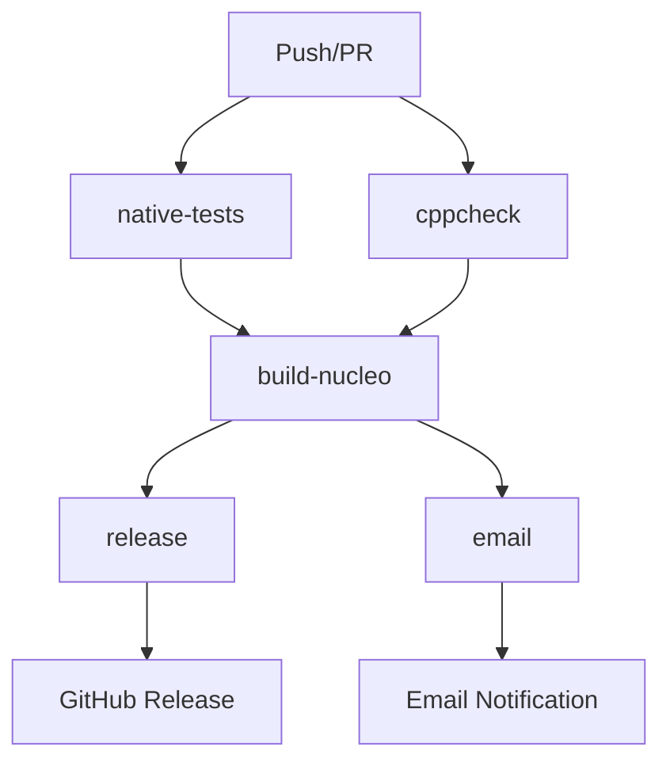

# 🚀 CI/CD Pipeline - DPM2_NUCLEO

## 📋 Vue d'ensemble

Cette pipeline CI/CD automatise la validation, le build et le déploiement du firmware STM32 NUCLEO-F411RE du projet DPM2. Elle s'inspire de la pipeline ESP32 existante et fournit une intégration complète avec GitHub Actions.

## 🏗️ Architecture de la Pipeline



## 🎯 Jobs de la Pipeline

### 1. **native-tests** 🧪
**Objectif**: Exécuter les tests unitaires sur l'environnement Ubuntu

**Actions**:
- Installation des dépendances (gcc, make, python3)
- Cache des dépendances Unity
- Exécution des tests natifs avec `make test-native`
- Conversion des résultats Unity vers JUnit XML
- Génération d'un rapport Markdown
- Publication du résumé dans GitHub Actions

**Artefacts**:
- `nucleo-test-results/` : Logs et rapports de tests

### 2. **cppcheck** 🔍
**Objectif**: Analyse statique du code C pour détecter les problèmes potentiels

**Actions**:
- Installation de cppcheck et dépendances Python
- Analyse du code avec suppressions appropriées
- Génération de rapport HTML (si disponible)
- Comptage des erreurs et avertissements

**Artefacts**:
- `nucleo-cppcheck-html/` : Rapport HTML d'analyse

### 3. **build-nucleo** 🔨
**Objectif**: Compilation du firmware STM32F411RE

**Actions**:
- Installation de la toolchain ARM (gcc-arm-none-eabi)
- Cache des fichiers de build
- Génération automatique d'un Makefile optimisé
- Compilation vers .elf, .hex, .bin, .map
- Packaging avec documentation d'utilisation

**Artefacts**:
- `nucleo-firmware-{version}.zip` : Package firmware complet

### 4. **release** 📦
**Objectif**: Création automatique de releases GitHub sur les tags

**Conditions**: Déclenché uniquement sur les tags `v*.*.*`

**Actions**:
- Téléchargement des artefacts de build
- Création d'une release GitHub avec le firmware
- Utilisation du message de commit comme description

### 5. **email** 📧
**Objectif**: Notification par email des résultats de build

**Actions**:
- Composition d'un email de statut détaillé
- Envoi conditionnel (secrets configurés + pas de PR)
- Liens vers les détails et artefacts

## ⚙️ Configuration

### Variables d'Environnement

```yaml
env:
  ENABLE_S3_UPLOAD: "false"      # Upload S3 désactivé
  ARTEFACT_NAME: nucleo-firmware  # Nom base des artefacts
```

### Secrets Requis (Optionnels)

Pour les notifications email :
- `SMTP_HOST` : Serveur SMTP
- `SMTP_PORT` : Port SMTP (587 recommandé)
- `SMTP_USERNAME` : Utilisateur SMTP
- `SMTP_PASSWORD` : Mot de passe SMTP
- `MAIL_FROM` : Adresse expéditeur
- `MAIL_TO` : Adresse destinataire

## 🎮 Déclencheurs

### Push Events
```yaml
branches: [ "main", "develop" ]  # Branches principales
tags: [ "v*.*.*" ]              # Tags de version
```

### Pull Requests
- Tous les PRs déclenchent tests + cppcheck
- Pas d'email ni de release sur les PRs

## 📊 Rapports et Artefacts

### Tests Unitaires
- **Format** : JUnit XML + Markdown
- **Contenu** : Résultats détaillés par test
- **Affichage** : GitHub Actions Summary

### Analyse Statique
- **Format** : XML + HTML
- **Outil** : cppcheck avec règles STM32
- **Suppressions** : Configurées pour l'embarqué

### Firmware Package
```
nucleo-firmware-v1.0.0.zip
├── DPM2_NUCLEO.bin    # Image binaire
├── DPM2_NUCLEO.hex    # Format Intel HEX
├── DPM2_NUCLEO.elf    # Binaire avec symboles
├── DPM2_NUCLEO.map    # Carte mémoire
└── README.txt         # Instructions flash/debug
```

## 🛠️ Utilisation Locale

### Script CI Local
```bash
# Tests complets
./scripts/ci-local.sh --all

# Tests seulement
./scripts/ci-local.sh --tests

# Cppcheck seulement
./scripts/ci-local.sh --cppcheck --no-tests

# Mode verbeux
./scripts/ci-local.sh --verbose
```

### Validation Workflow
```bash
# Vérifier la syntaxe YAML
./scripts/validate-workflow.sh
```

## 🔧 Personnalisation

### Ajouter un Nouveau Job

1. **Définir le job** dans `.github/workflows/nucleo-ci.yml`
2. **Configurer les dépendances** avec `needs:`
3. **Ajouter les steps** nécessaires
4. **Gérer les artefacts** si applicable

### Modifier les Triggers

```yaml
on:
  push:
    branches: [ "main", "develop", "feature/*" ]
    paths: 
      - 'DPM2_NUCLEO/**'
      - '.github/workflows/nucleo-ci.yml'
```

### Personnaliser le Build

Le Makefile est généré automatiquement mais peut être personnalisé :

```yaml
- name: Create custom Makefile
  run: |
    cat > DPM2_NUCLEO/Makefile.custom <<'EOF'
    # Votre Makefile personnalisé
    EOF
```

## 📈 Optimisations

### Cache Strategy
- **Unity Framework** : Cache basé sur les fichiers de test
- **ARM Toolchain** : Cache des dépendances système
- **PlatformIO Style** : Cache basé sur les hashes de fichiers

### Parallel Execution
- `native-tests` et `cppcheck` s'exécutent en parallèle
- `build-nucleo` attend les deux précédents
- `release` et `email` s'exécutent après le build

### Performance Tips
- Utilisation de `actions/cache@v4` pour les dépendances
- Compilation optimisée avec `-Os`
- Artefacts compressés automatiquement

## 🐛 Debugging

### Logs Détaillés
```yaml
- name: Debug step
  run: |
    set -x  # Mode debug bash
    # Vos commandes
```

### Artefacts de Debug
```yaml
- name: Upload debug logs
  if: failure()
  uses: actions/upload-artifact@v4
  with:
    name: debug-logs
    path: |
      **/*.log
      **/build/
```

### Tests Locaux
```bash
# Reproduire l'environnement CI
docker run --rm -it ubuntu:latest bash
apt-get update && apt-get install -y gcc make python3 cppcheck
# Exécuter vos commandes
```

## 🔒 Sécurité

### Permissions Minimales
```yaml
permissions:
  contents: write  # Pour les releases seulement
```

### Secrets Management
- Utilisation de GitHub Secrets
- Pas de credentials en dur dans le code
- Validation conditionnelle des secrets

### Supply Chain Security
- Versions fixes des actions (`@v4`)
- Vérification des checksums (recommandé)
- Scan des dépendances (futur)

## 📚 Références

- [GitHub Actions Documentation](https://docs.github.com/en/actions)
- [STM32 Development with GitHub Actions](https://github.com/STMicroelectronics/stm32-mcu-developer-zone)
- [Unity Testing Framework](http://www.throwtheswitch.org/unity)
- [ARM GCC Toolchain](https://developer.arm.com/tools-and-software/open-source-software/developer-tools/gnu-toolchain/gnu-rm)

## 🤝 Contribution

### Ajouter des Tests
1. Créer les fichiers dans `test/native/test_*/`
2. Ajouter au `Makefile` si nécessaire
3. La CI détectera automatiquement les nouveaux tests

### Modifier la Pipeline
1. Tester localement avec `validate-workflow.sh`
2. Créer une PR avec les modifications
3. Vérifier les résultats sur une branche de test

### Rapporter des Problèmes
- Utiliser les logs GitHub Actions
- Reproduire localement avec `ci-local.sh`
- Fournir les artefacts de debug

---

## ✨ Résumé des Fonctionnalités

| Fonctionnalité | Status | Description |
|---|:---:|---|
| **Tests Natifs** | ✅ | Unity + JUnit + Markdown |
| **Analyse Statique** | ✅ | cppcheck + HTML reports |
| **Build ARM** | ✅ | gcc-arm-none-eabi + artefacts |
| **Releases Auto** | ✅ | GitHub releases sur tags |
| **Notifications** | ✅ | Email avec résumé détaillé |
| **Cache Intelligent** | ✅ | Optimisation des builds |
| **Scripts Locaux** | ✅ | Test et validation offline |
| **Documentation** | ✅ | Guide complet d'utilisation |

**🎯 La pipeline NUCLEO CI/CD est prête pour la production !** 🚀

