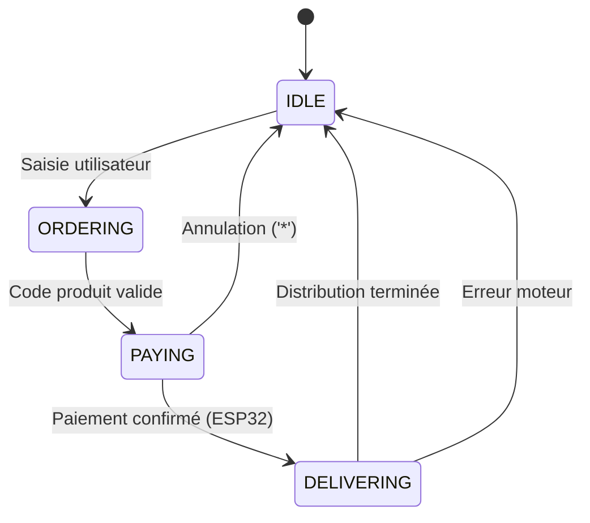

# 🤖 DPM2_NUCLEO - Distributeur de Boissons Intelligent

## 📋 Vue d'ensemble

**DPM2_NUCLEO** est la partie embarquée du système de distributeur de boissons intelligent DPM2. Elle gère le contrôle des moteurs, capteurs, interfaces utilisateur et la communication avec l'ESP32 pour la connectivité réseau.

### 🏗️ Architecture Système

```
┌─────────────────┐    UART     ┌──────────────────┐
│   STM32 NUCLEO  │◄────────────►│      ESP32       │
│    F411RE       │              │   (DPM2_ESP)     │
│                 │              │                  │
│ • Moteurs DC    │              │ • Wi-Fi          │
│ • Capteurs ToF  │              │ • NFC/QR         │
│ • LCD + Keypad  │              │ • Backend API    │
│ • Orchestration │              │ • Paiements      │
└─────────────────┘              └──────────────────┘
```

## 🎯 Fonctionnalités Principales

### ✅ **Contrôle Hardware**
- **6 Moteurs DC** : Distribution via L298N + multiplexeurs CD74HC4067
- **Capteurs ToF VL6180X** : Détection de stock en temps réel
- **LCD 16x2 I2C** : Interface utilisateur
- **Clavier matriciel 3x4** : Saisie utilisateur
- **LEDs d'état** : Retour visuel

### ✅ **Gestion Logicielle**
- **FreeRTOS** : Multitâches temps réel
- **Machine à États** : Orchestration des flux
- **Communication UART** : Interface ESP32
- **Validation Sécurisée** : Codes produits et entrées
- **Watchdog Système** : Fiabilité et récupération

### ✅ **Architecture Événementielle**
- **Services Modulaires** : Isolation des responsabilités
- **Queues FreeRTOS** : Communication inter-tâches
- **Thread Safety** : Accès sécurisé aux ressources partagées
- **Gestion d'Erreurs** : Récupération automatique

## 🔧 Configuration Hardware

### **Microcontrôleur**
- **MCU** : STM32F411RE (ARM Cortex-M4, 100 MHz)
- **Flash** : 512 KB
- **RAM** : 128 KB
- **Développement** : STM32 NUCLEO-F411RE

### **Périphériques**

| Composant | Interface | Pins | Description |
|-----------|-----------|------|-------------|
| **LCD 16x2** | I2C1 | PB8(SCL), PB9(SDA) | Affichage utilisateur |
| **Clavier 3x4** | GPIO | PC0-PC3, PB0-PB3 | Saisie codes produits |
| **Moteurs DC** | PWM+GPIO | PC0-PC3, PB0 | Distribution boissons |
| **Capteur ToF** | I2C1 | PB8(SCL), PB9(SDA), PB1(SHUT) | Détection stock |
| **ESP32 UART** | UART1 | PA9(TX), PA10(RX) | Communication réseau |
| **Debug UART** | UART2 | PB7(RX), PA15(TX) | Logs de développement |

### **Alimentation**
- **Principale** : 5V 10A (moteurs + logique)
- **MCU** : 3.3V via régulateur intégré NUCLEO
- **Capteurs** : 3.3V (I2C pull-ups intégrés)

## 🚀 Démarrage Rapide

### **Prérequis**
```bash
# Outils de développement
sudo apt-get install gcc-arm-none-eabi make openocd

# Tests unitaires (optionnel)
sudo apt-get install gcc python3 cppcheck lcov
```

### **Compilation**
```bash
# Cloner le projet
git clone <repository-url>
cd DPM2_NUCLEO

# Compiler le firmware
make all

# Flasher sur la carte
st-flash write DPM2_NUCLEO.bin 0x8000000
```

### **Tests Unitaires**
```bash
cd test

# Tests natifs (PC)
make test-native

# Tests individuels
make test-native-orchestrator
make test-native-watchdog
make test-native-global_state

# Génération de rapports
make test-reports
```

## 🏗️ Architecture Logicielle

### **Organisation FreeRTOS**

```
main()
├── Hardware Init (HAL, GPIO, I2C, UART)
├── FreeRTOS Kernel Start
└── Tasks Creation
    ├── orchestratorTask    (Priorité: Normal)
    ├── keypadTask         (Priorité: Normal)  
    ├── lcdTask           (Priorité: Normal)
    ├── motorTask         (Priorité: Normal)
    ├── sensorStockTask   (Priorité: Normal)
    ├── espCommTask       (Priorité: Normal)
    └── watchdogTask      (Priorité: Realtime)
```

### **Services Modulaires**

| Service | Responsabilité | Fichiers |
|---------|----------------|----------|
| **Orchestrator** | Machine à états principale | `orchestrator.{c,h}` |
| **Keypad** | Lecture clavier + anti-rebond | `keypad_service.{c,h}` |
| **LCD** | Affichage messages utilisateur | `lcd_service.{c,h}` |
| **Motor** | Contrôle moteurs + distribution | `motor_service.{c,h}` |
| **Sensor Stock** | Mesure ToF + détection stock | `sensor_stock_service.{c,h}` |
| **ESP Comm** | Communication UART avec ESP32 | `esp_communication_service.{c,h}` |
| **Watchdog** | Surveillance système + IWDG | `watchdog_service.{c,h}` |

### **Machine à États**



### **Communication UART (ESP32)**

**Format** : Protocole texte simple
```
NUCLEO → ESP32:
- "STATE:PAYING"     # Demande validation paiement
- "NFC_SCAN:START"   # Déclencher scan NFC
- "STATUS:READY"     # État système

ESP32 → NUCLEO:
- "ACK:STATE:PAYING"         # Paiement autorisé
- "NAK:STATE:PAYING:NO_NET"  # Pas de réseau
- "NAK:STATE:PAYING:DENIED"  # Paiement refusé
- "NFC_UID:1A2B3C4D"        # UID carte NFC
```

## 🧪 Tests et Qualité

### **Framework de Tests**
- **Unity** : Framework de tests C embarqué
- **Mocks** : HAL, FreeRTOS, services externes
- **Coverage** : Rapports de couverture avec gcov
- **CI/CD** : Pipeline GitHub Actions complète

### **Tests Implémentés**
- ✅ **Orchestrator Logic** : Machine à états, validation codes
- ✅ **Watchdog Service** : IWDG, surveillance tâches  
- ✅ **Global State** : Thread safety, accès concurrents
- ✅ **Service Integration** : Communication inter-services

### **Métriques Qualité**
```bash
# Exécuter tous les tests
./scripts/ci-local.sh --all

# Analyse statique
cppcheck --enable=all Core/Src/

# Coverage report
make coverage
```

## 🔒 Sécurité et Fiabilité

### **Mesures de Sécurité OWASP**
- ✅ **Validation d'Entrées** : Filtrage caractères, longueurs
- ✅ **Thread Safety** : Mutex pour ressources partagées
- ✅ **Stack Protection** : Détection débordements
- ✅ **Watchdog** : Récupération automatique des pannes
- ✅ **Error Handling** : Gestion robuste des erreurs

### **Fiabilité Système**
- **Independent Watchdog (IWDG)** : Reset automatique en cas de blocage
- **Task Monitoring** : Surveillance heartbeat des tâches critiques
- **Brown-out Detection** : Protection contre les chutes de tension
- **Error Recovery** : Redémarrage gracieux en cas d'erreur

## 🛠️ Développement

### **Structure du Projet**
```
DPM2_NUCLEO/
├── Core/
│   ├── Inc/                 # Headers principaux
│   │   ├── Services/        # Headers services
│   │   └── orchestrator.h   # Orchestrateur principal
│   └── Src/                 # Sources principales
│       ├── Services/        # Implémentations services
│       ├── orchestrator.c   # Orchestrateur principal
│       └── main.c          # Point d'entrée
├── Drivers/                 # Drivers STM32 HAL
├── Middlewares/            # FreeRTOS + CMSIS-RTOS2
├── test/                   # Framework de tests
│   ├── native/            # Tests natifs (PC)
│   ├── mocks/            # Mocks HAL/FreeRTOS
│   ├── unity/            # Framework Unity
│   └── scripts/          # Scripts d'automation
├── scripts/               # Scripts CI/CD
├── .github/workflows/     # Pipeline GitHub Actions
└── README.md             # Cette documentation
```

### **Workflow de Développement**
1. **Feature Branch** : Créer une branche pour les nouvelles fonctionnalités
2. **TDD** : Écrire les tests avant le code
3. **Local Testing** : `./scripts/ci-local.sh --all`
4. **Pull Request** : Validation automatique via CI/CD
5. **Code Review** : Revue par les pairs
6. **Merge** : Intégration en branche principale

### **Debugging**
```bash
# GDB avec OpenOCD
openocd -f interface/stlink.cfg -f target/stm32f4x.cfg &
arm-none-eabi-gdb DPM2_NUCLEO.elf
(gdb) target extended-remote :3333
(gdb) monitor reset halt
(gdb) load
(gdb) continue

# Logs UART2 (debug)
minicom -D /dev/ttyACM1 -b 115200

# Analyse mémoire
arm-none-eabi-nm DPM2_NUCLEO.elf | sort
arm-none-eabi-objdump -h DPM2_NUCLEO.elf
```

## 🚀 CI/CD Pipeline

### **GitHub Actions Workflow**
- ✅ **Tests Natifs** : Exécution sur Ubuntu
- ✅ **Analyse Statique** : cppcheck avec rapports HTML
- ✅ **Build ARM** : Compilation firmware STM32
- ✅ **Releases Automatiques** : Sur tags `v*.*.*`
- ✅ **Notifications Email** : Résultats détaillés

### **Artefacts Générés**
- **Firmware Package** : .bin, .hex, .elf, .map + documentation
- **Test Reports** : JUnit XML + Markdown summaries
- **Static Analysis** : HTML reports avec métriques
- **GitHub Releases** : Packages prêts à flasher

### **Utilisation Locale**
```bash
# Pipeline complète
./scripts/ci-local.sh --all

# Tests seulement
./scripts/ci-local.sh --tests --verbose

# Validation workflow
./scripts/validate-workflow.sh
```

## 📊 Monitoring et Diagnostics

### **Métriques Système**
- **Task CPU Usage** : Monitoring via FreeRTOS stats
- **Heap Usage** : Surveillance mémoire dynamique
- **Stack High Water** : Détection débordements potentiels
- **Watchdog Statistics** : Compteurs de timeouts et resets

### **Logs de Debug**
```c
// Logs sécurisés avec masquage données sensibles
LOGI("System", "Boot completed, free heap: %lu bytes", xPortGetFreeHeapSize());
LOGW("Motor", "Channel %d timeout, retrying...", channel);
LOGE("UART", "Invalid command received: %.10s...", buffer);
```

### **Diagnostic Hardware**
- **I2C Bus Scan** : Détection périphériques connectés
- **GPIO State** : État des pins en temps réel
- **Clock Configuration** : Vérification horloges système
- **Voltage Monitoring** : Surveillance alimentation

## 🤝 Intégration ESP32

### **Communication Bidirectionnelle**
```c
// NUCLEO → ESP32
EspComm_SendLine("STATE:PAYING");

// ESP32 → NUCLEO (callback)
void HAL_UART_RxCpltCallback(UART_HandleTypeDef *huart) {
    if (huart == &huart1) {  // ESP32 UART
        UartParser_ProcessLine(rx_buffer);
    }
}
```

### **Synchronisation États**
- **Paiement** : NUCLEO demande, ESP32 valide
- **Stock** : NUCLEO surveille, ESP32 notifie backend
- **Erreurs** : Remontée bidirectionnelle
- **Heartbeat** : Surveillance connexion ESP32

## 📚 Ressources et Références

### **Documentation Technique**
- [STM32F411RE Reference Manual](https://www.st.com/resource/en/reference_manual/dm00119316-stm32f411xce-advanced-armbased-32bit-mcus-stmicroelectronics.pdf)
- [FreeRTOS Documentation](https://www.freertos.org/Documentation/RTOS_book.html)
- [Unity Testing Framework](http://www.throwtheswitch.org/unity)
- [OWASP Embedded Security](https://owasp.org/www-project-embedded-application-security/)

### **Outils de Développement**
- [STM32CubeIDE](https://www.st.com/en/development-tools/stm32cubeide.html)
- [STM32CubeMX](https://www.st.com/en/development-tools/stm32cubemx.html)
- [OpenOCD](http://openocd.org/)
- [ARM GNU Toolchain](https://developer.arm.com/tools-and-software/open-source-software/developer-tools/gnu-toolchain/gnu-rm)

## 🎯 Roadmap

### **Version Actuelle (v1.0)**
- ✅ Architecture de base FreeRTOS
- ✅ Services modulaires complets
- ✅ Communication ESP32 fonctionnelle
- ✅ Tests unitaires comprehensive
- ✅ Pipeline CI/CD opérationnelle
- ✅ Sécurité OWASP intégrée

### **Prochaines Versions**
- 🔄 **v1.1** : Optimisations performance et mémoire
- 📋 **v1.2** : Interface utilisateur avancée (menus)
- 🔐 **v1.3** : Chiffrement communication UART
- 📊 **v1.4** : Télémétrie et monitoring avancé
- 🎯 **v2.0** : Support multi-distributeurs

---

## 📞 Support et Contribution

### **Issues et Bugs**
- Utiliser GitHub Issues avec templates appropriés
- Fournir logs complets et contexte de reproduction
- Tester avec la dernière version stable

### **Contributions**
- Fork → Feature Branch → Pull Request
- Respecter le style de code existant
- Ajouter tests pour les nouvelles fonctionnalités
- Mettre à jour la documentation

### **Contact**
- **Équipe Développement** : [Votre contact]
- **Documentation** : Ce README + `CI_CD.md` + `TESTING.md`
- **Support Technique** : GitHub Issues

---

**🤖 DPM2_NUCLEO - Firmware STM32 Professionnel pour Distributeur Intelligent** 🚀✨
